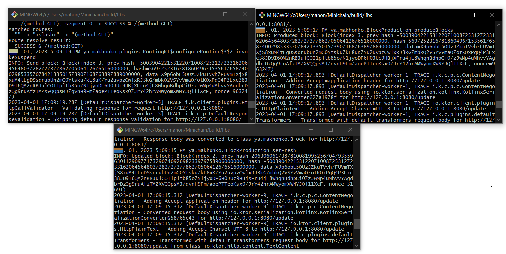

# Minichain

Main:
[](https://github.com/Thandriss/Minichain/actions/workflows/gradle-tests.yml)
Develop:
[](https://github.com/Thandriss/Minichain/actions/workflows/gradle-test.yml)
Для осуществления работы сервера был использован фреймворк Ktor.

Для сборки артефакта:
- Linux: ./gradlew jar
- Windows gradlew.bat jar

Созданный артефакт находится в /build/libs.

Запускать через командную строку в консоли/терминале.

Обязательные команды:
* p -- порт,для открытия сервера;
* n -- другие узлы, в формате IPv4:port через запятую;

Не обязательные команды:
* f -- флаг для генерации 1-го блока, должен использоваться только 1 раз при запуске;

Пример запуска:
```
java -jar Minichain-ver.jar -p 8082 -n 127.0.0.1:8080,127.0.0.1:8081 -f
```
* ver -- версия;

Пример работы



Для сборки docker-образа:

run.bat/run.sh в командной строке/терминале с использованием Docker

или

```
docker build -t thandriss/minichain .
docker-compose up
```

#Тестирование 
Были созданы модульные, интеграционные и нагрузочные тесты:
1. К первым тестам относятся все тесты в файле ApplicationTest: checkingProduction(), checkArgs(), firstBlockProductionChecking(), blockMethodsTests();
2. Ко вторым -- checkServerBehaviour() в файле RoutingTest
3. Для третьего вида тестирования был оздан тест checkAverageTime в файле RoutingTest 